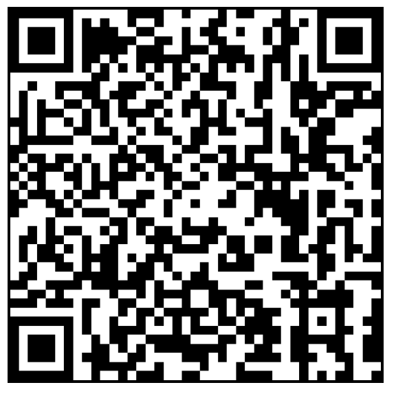
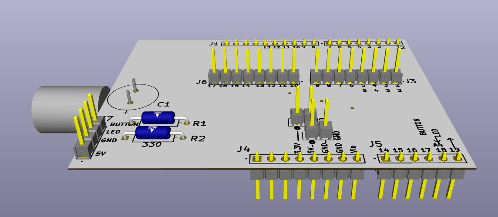
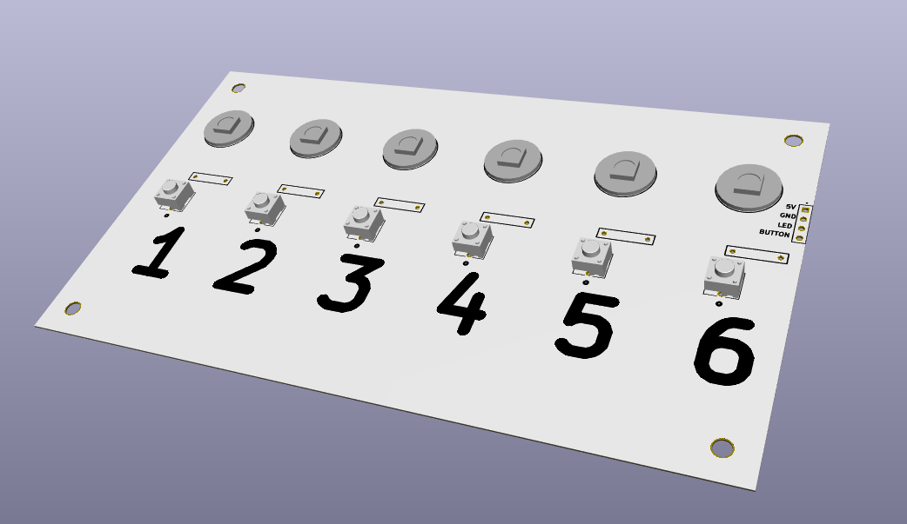
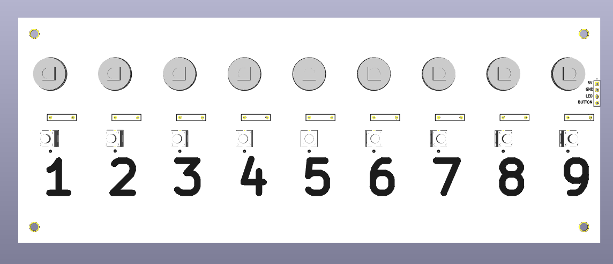
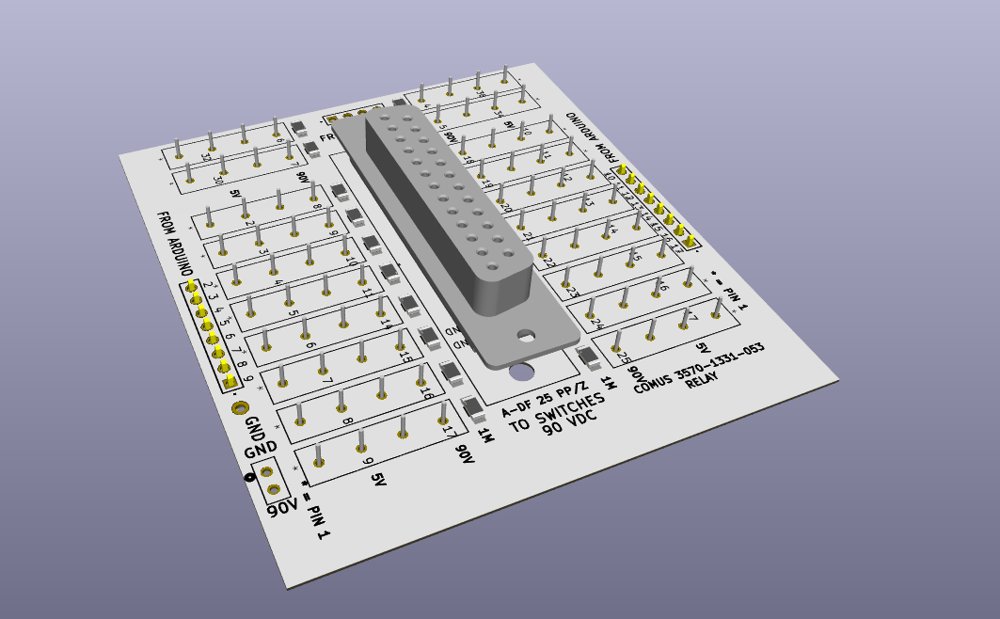

# [Switch Control Boards](https://github.com/lafefspietz/switch-control-boards)

Generic control panel circuit boards for building physical human computer interfaces into control systems based on the [MEMSDuino](https://github.com/lafefspietz/MEMSduino/) open source repository.  That system is designed for controlling the 90 volt control lines of a network of MEMS(Micro Electrical Mechanical System) based radio frequency(RF) switches which are used for calibration and testing of measurement systems for the development of quantum computing technology.  The 90 volt signals in that system are controlled using a set of cheap 5 volt electromechanical relays which are from the telecommunications industry.

This project begins with converting all the Altium files into KiCAD and then making various forks to those boards. It is being used as an excuse to learn KiCAD in order to switch from Altium to KiCAD in general by porting the circuit boards from MEMSDuino into KiCAD and then making useful modifications.

## Arduino to Headers Board

This board connects between the Arduino UNO and a set of headers which go to the various other circuit boards.

 - [arduino-to-headers-shield.kicad_sch](arduino-to-headers-shield.kicad_sch)
 - [arduino-to-headers-shield.kicad_pcb](arduino-to-headers-shield.kicad_pcb)
 - [arduino-to-headers-shield.kicad_pro](arduino-to-headers-shield.kicad_pro)

## 6 State Control Board

Control board with 6 buttons and 6 programmable RGB LED indicator lights.

 - [6button-6neopixel.kicad_pcb](6button-6neopixel.kicad_pcb)
 - [6button-6neopixel.kicad_pro](6button-6neopixel.kicad_pro)
 - [6button-6neopixel.kicad_sch](6button-6neopixel.kicad_sch)

## 9 State Control Board

Control board with 9 buttons and 9 programmable RGB LED indicator lights.

 - [9button-9neopixel.kicad_pcb](9button-9neopixel.kicad_pcb)
 - [9button-9neopixel.kicad_pro](9button-9neopixel.kicad_pro)
 - [9button-9neopixel.kicad_sch](9button-9neopixel.kicad_sch)
 
## DB25 Relay Control Board  

This board uses a set of 5 volt control lines from the Arduino UNO to control a set of electromechanical relays which turn connect a high voltge(90 V) line to any of the  pins on the DB25 connector.

 - [DB25-relay-HV-control.kicad_pcb](DB25-relay-HV-control.kicad_pcb)
 - [DB25-relay-HV-control.kicad_pro](DB25-relay-HV-control.kicad_pro)
 - [DB25-relay-HV-control.kicad_sch](DB25-relay-HV-control.kicad_sch)

 
